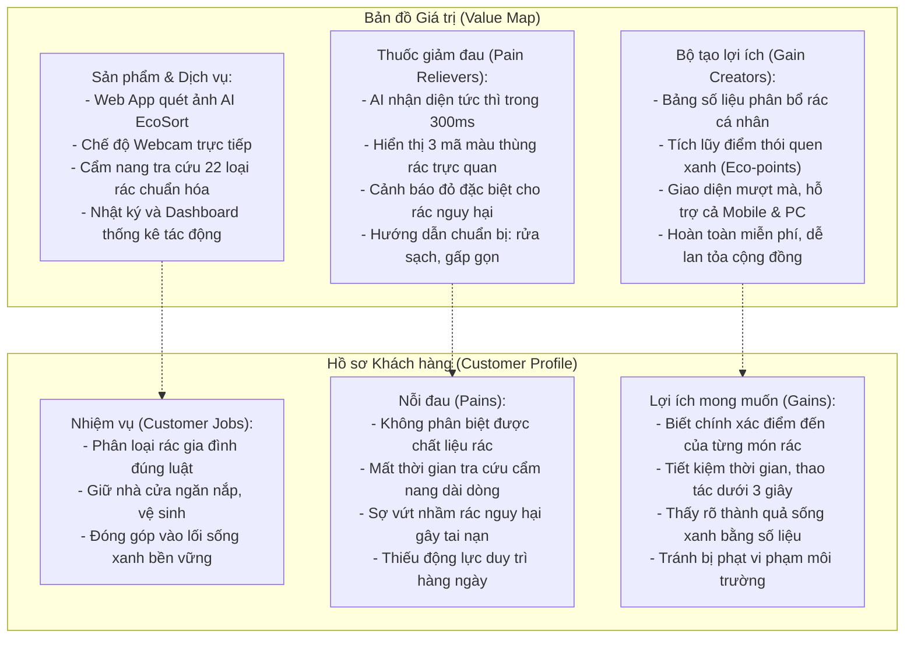

# TÀI LIỆU KHÁM PHÁ SẢN PHẨM (PRODUCT DISCOVERY)

## ĐỀ TÀI: ECOSORT AI
### HỆ THỐNG PHÂN LOẠI RÁC THẢI THÔNG MINH ỨNG DỤNG THỊ GIÁC MÁY TÍNH VÀ TRÍ TUỆ NHÂN TẠO (AI)
**Phiên bản:** 1.0.0  
**Trạng thái:** Approved / Discovery Baseline  
**Nhóm tác giả:** EcoSort AI Engineering & Product Team  
**Ngày hoàn thành:** 08/09/2026  

---

## 1. BỐI CẢNH & KHÔNG GIAN VẤN ĐỀ (PROBLEM SPACE & SOCIETAL CONTEXT)

### 1.1. Bối cảnh thực tiễn và tính cấp thiết xã hội
Rác thải sinh hoạt đô thị đang là một trong những thách thức môi trường cấp bách nhất tại Việt Nam và các quốc gia đang phát triển. Theo số liệu của Bộ Tài nguyên và Môi trường:
* Mỗi ngày, các đô thị tại Việt Nam phát sinh hơn **60.000 tấn rác thải sinh hoạt**, trong đó TP. Hồ Chí Minh và Hà Nội chiếm hơn 18.000 tấn/ngày.
* Hơn **71% lượng rác thải** vẫn đang được xử lý bằng phương pháp chôn lấp truyền thống không hợp vệ sinh, gây ô nhiễm nghiêm trọng nguồn nước ngầm, phát sinh mùi hôi và khí nhà kính ($CH_4, CO_2$).
* Lượng rác thải nhựa phát sinh ước tính khoảng **1,8 triệu tấn/năm**, nhưng chỉ có khoảng **10% - 15%** được thu gom và tái chế thực sự. Phần lớn rác có thể tái chế bị vùi lấp hoặc rò rỉ ra đại dương do bị lẫn tạp chất, dính dầu mỡ hoặc không được phân loại đúng cách ngay từ đầu nguồn.

Đặc biệt, theo quy định của **Luật Bảo vệ Môi trường 2020** (có hiệu lực bắt buộc thực thi phân loại rác tại nguồn từ năm 2025/2026), các hộ gia đình và cơ quan, trường học không thực hiện phân loại rác sinh hoạt sẽ đối mặt với các mức chế tài xử phạt hành chính và từ chối thu gom rác. Tuy nhiên, hạ tầng và công cụ hỗ trợ người dân tự phân loại tại nhà vẫn còn rất thiếu thốn.

```
+-----------------------------------------------------------------------------------+
|                        VÒNG XOÁY KHỦNG HOẢNG RÁC THẢI ĐÔ THỊ                      |
+-----------------------------------------------------------------------------------+
|  Thiếu công cụ hướng dẫn   --->   Người dân phân loại sai / không phân loại        |
|                                                     |                             |
|                                                     v                             |
|  Chi phí tái chế tăng vọt  <---   Rác tái chế bị nhiễm bẩn tại bãi tập kết        |
|               |                                                                   |
|               v                                                                   |
|  >70% Rác đem chôn lấp / đốt thủ công   --->   Ô nhiễm môi trường & Lãng phí tài nguyên |
+-----------------------------------------------------------------------------------+
```

### 1.2. Phân tích các Nỗi đau Cốt lõi (Pain Points)

#### A. Rào cản nhận thức và ma trận bao bì phức tạp (Cognitive Friction)
* Người tiêu dùng thường bối rối trước hàng trăm loại vật dụng hàng ngày: Cốc giấy phủ màng nhựa PE có tái chế được không? Vỏ hộp sữa tetra-pak gồm nhiều lớp nhôm và giấy xử lý thế nào? Chai hóa chất tẩy rửa có được bỏ chung với chai nước khoáng PET?
* Các biểu tượng tái chế (nhựa số 1 đến số 7) trên đáy bao bì thường rất nhỏ, mờ và khó hiểu đối với người dân bình thường. Sự thiếu thông tin dẫn đến hiện tượng **"Wishcycling"** (bỏ bừa mọi thứ vào thùng tái chế với hy vọng chúng sẽ được tái chế, gây nhiễm bẩn toàn bộ lô rác sạch) hoặc bỏ cuộc và vứt lẫn lộn vào rác thải sinh hoạt thông thường.

#### B. Nguy cơ từ rác thải nguy hại gia dụng (Household Hazardous Waste)
* Pin đã qua sử dụng, bóng đèn huỳnh quang, bình xịt côn trùng, vỏ sơn tồn dư hóa chất kim loại nặng (chì, thủy ngân, cadmium) thường bị người dân tiện tay ném chung vào túi rác sinh hoạt.
* Khi đưa vào lò đốt hoặc chôn lấp, các chất độc này ngấm vào đất, nguồn nước sinh hoạt hoặc phát tán khí độc dioxin, gây nguy hiểm trực tiếp cho sức khỏe cộng đồng và công nhân vệ sinh đô thị.

#### C. Sự thiếu tiện ích của các công cụ tra cứu truyền thống
* Các cẩm nang phân loại in trên giấy hoặc tài liệu PDF của chính quyền thường mang tính hàn lâm, dài dòng và không thể đem theo khi đứng trước thùng rác.
* Người dùng cần một giải pháp **nhận thức tức thì (Instant Recognition)**: Chỉ cần hướng camera điện thoại hoặc webcam máy tính vào đồ vật, hệ thống phải trả lời ngay trong vài trăm mili-giây: "Đây là gì? Bỏ vào thùng màu nào? Cần chuẩn bị/rửa sạch như thế nào?".

---

## 2. NGHIÊN CỨU & THẤU CẢM NGƯỜI DÙNG (USER RESEARCH & EMPATHY MAPPING)

### 2.1. Kết quả khảo sát thực nghiệm định lượng
Nhóm phát triển đã thực hiện khảo sát ngẫu nhiên với cỡ mẫu **N = 350 người** (bao gồm sinh viên đại học, cư dân chung cư, nhân viên văn phòng và người nội trợ tại đô thị) với kết quả ghi nhận:

| Chỉ số Khảo sát | Tỷ lệ Đồng thuận | Phân tích Ý nghĩa |
| :--- | :---: | :--- |
| **Nhận thức về tầm quan trọng của phân loại rác** | **92.6%** | Đa số người dân đều có ý thức bảo vệ môi trường và muốn thực hiện phân loại. |
| **Thường xuyên phân vân không biết rác thuộc nhóm nào** | **84.3%** | "Pain point" lớn nhất là thiếu kiến thức nhận diện tức thời từng loại bao bì. |
| **Sẵn sàng sử dụng công cụ AI quét camera nhận diện rác** | **91.4%** | Nhu cầu cực lớn cho một ứng dụng thị giác máy tính trực quan, miễn phí. |
| **Không muốn tải thêm app rườm rà (ưu tiên chạy ngay trên Web)** | **78.9%** | Ứng dụng nền tảng Web tương thích mobile/desktop có tỷ lệ tiếp cận cao hơn hẳn Native App. |
| **Hào hứng với điểm thưởng xanh & bảng thống kê tác động** | **76.2%** | Yếu tố Gamification (Eco-points) là động lực duy trì thói quen lâu dài. |

### 2.2. Bản đồ Thấu cảm Người dùng (Empathy Map)

```text
┌──────────────────────────────────────┬──────────────────────────────────────┐
│                SAYS                  │                THINKS                │
│ • "Tôi muốn phân loại rác nhưng     │ • "Hộp xốp dính dầu mỡ này có tái    │
│   không biết vỏ hộp này có được     │   chế được không nhỉ?"               │
│   tái chế không."                   │ • "Nếu mình phân loại mà xe gom lại  │
│ • "Nhìn ký hiệu dưới đáy chai hoa cả │   đổ chung thì có uổng công không?"  │
│   mắt, chẳng hiểu số 5 nghĩa là gì."│ • "Ước gì giơ điện thoại lên là máy  │
│ • "Vứt nhầm pin ra thùng rác cảm    │   bảo ngay vứt vào thùng nào."       │
│   thấy rất áy náy."                 │                                      │
├──────────────────────────────────────┼──────────────────────────────────────┤
│                DOES                  │                FEELS                 │
│ • Tiện tay vứt chung tất cả rác vào  │ • Bối rối, lúng túng trước các thùng │
│   một túi nilon duy nhất.            │   rác công cộng 3 màu.               │
│ • Thỉnh thoảng gom chai nhựa sạch để │ • Áp lực khi luật môi trường mới có  │
│   bán ve chai, còn lại vứt bừa.      │   thể xử phạt hành chính.            │
│ • Tra cứu Google khi có thời gian    │ • Tự hào, phấn khích khi biết hành   │
│   nhưng kết quả chung chung, mâu     │   động nhỏ của mình giúp giảm được bao│
│   thuẫn giữa các nguồn.              │   nhiêu kg CO2 ra khí quyển.         │
└──────────────────────────────────────┴──────────────────────────────────────┘
```

---

## 3. PHÂN TÍCH ĐỐI THỦ CẠNH TRANH & ĐỊNH VỊ THỊ TRƯỜNG (COMPETITIVE BENCHMARKING)

### 3.1. Ma trận so sánh giải pháp hiện hữu

| Tiêu chí Đánh giá | Google Lens / Generic AI | Recycle Coach (Quốc tế) | Thùng rác thông minh (Bin-e, CleanRobotics) | **EcoSort AI (Giải pháp đề xuất)** |
| :--- | :--- | :--- | :--- | :--- |
| **Khả năng nhận diện vật thể rác** | Nhận diện tổng quát (tên thương hiệu, sản phẩm) | Không có AI camera (chủ yếu tra cứu text) | Rất cao (AI tích hợp bên trong buồng rác) | **Chuyên sâu 22 nhãn rác sinh hoạt phổ biến** |
| **Phân loại theo quy chuẩn tái chế** | Không (chỉ trả về kết quả tìm kiếm web) | Có (theo mã bưu chính quốc tế, không phù hợp VN) | Có (tự động gạt rác vào thùng tương ứng) | **Chuẩn hóa 3 nhóm: Tái chế - Không tái chế - Nguy hại** |
| **Chỉ dẫn xử lý sau nhận diện** | Không có | Có (dạng bài viết tĩnh) | Không cung cấp cho người dùng | **Chỉ dẫn hành động tức thời (Rửa sạch, ép xẹp, xử lý riêng)** |
| **Nền tảng & Rào cản tiếp cận** | Cài App Google | Cài App chuyên biệt | Phần cứng đắt đỏ ($3,000 - $5,000/thùng) | **Web-based 100%, chạy tức thì trên mọi trình duyệt** |
| **Hỗ trợ Webcam Realtime** | Không | Không | Cố định phần cứng | **Hỗ trợ cả Tải ảnh tĩnh & Quét Webcam trực tiếp** |
| **Thống kê & Gamification** | Không | Cơ bản | Dành riêng cho Enterprise | **Dashboard thống kê, phân bổ tỷ lệ rác, tích lũy lịch sử** |
| **Chi phí triển khai** | Miễn phí | Thu phí cơ quan đô thị | Rất đắt, bảo trì phức tạp | **Mã nguồn mở, chi phí vận hành siêu tối ưu** |

### 3.2. Đề xuất Giá trị Độc nhất (Unique Value Proposition - UVP)
> **"EcoSort AI biến chiếc điện thoại hoặc máy tính của bạn thành một Chuyên gia Phân loại Rác tức thì: Quét ảnh trong chớp mắt, định danh chính xác 3 nhóm rác sinh hoạt theo quy chuẩn địa phương, kèm hướng dẫn xử lý hành động cụ thể để bảo vệ môi trường."**

1. **Siêu tốc & Chính xác cao:** Sử dụng mô hình thị giác máy tính **YOLOv8** được huấn luyện riêng biệt trên bộ dữ liệu rác thải thực tế với 22 lớp nhãn, đạt độ trễ suy luận dưới **50ms** trên máy chủ và độ chính xác vượt trội trên vật thể rác biến dạng, nhàu nát.
2. **Không rào cản cài đặt:** Nền tảng Web hiện đại (React + Vite) tối ưu hóa trải nghiệm di động; người dùng mở trình duyệt là có thể quét ảnh hoặc bật camera lập tức mà không cần tải file APK/iOS nặng nề.
3. **Chỉ dẫn hành động thực chất:** Không dừng lại ở việc gán nhãn, hệ thống cung cấp mã màu trực quan (Xanh lục: Tái chế, Xám: Rác sinh hoạt, Đỏ: Rác nguy hại) kèm lời khuyên chuẩn bị vật liệu nhằm hạn chế nhiễm bẩn chéo.
4. **Minh bạch hóa tác động môi trường:** Tích hợp Firebase Firestore để lưu trữ lịch sử cá nhân và tổng hợp bảng điều khiển (Dashboard) thống kê thói quen phân loại rác theo thời gian thực.

---

## 4. KHUNG ĐỀ XUẤT GIÁ TRỊ & MÔ HÌNH KINH DOANH (VALUE PROPOSITION & BMC)

### 4.1. Khung Đề xuất Giá trị (Value Proposition Canvas)



### 4.2. Khung Mô hình Kinh doanh Tinh gọn (Lean Business Model Canvas)

| Khối BMC | Nội dung Chi tiết Dự án EcoSort AI |
| :--- | :--- |
| **1. Vấn đề (Problem)** | • Tỷ lệ phân loại rác tại nguồn ở Việt Nam <15% do người dân thiếu kiến thức phân biệt.<br/>• Luật BVMT 2020 phạt hành vi không phân loại nhưng thiếu công cụ trợ giúp.<br/>• Rác nguy hại bị vứt chung rác sinh hoạt gây ô nhiễm nguồn nước và đất. |
| **2. Phân khúc Khách hàng (Customer Segments)** | • **B2C (Trọng tâm):** Cư dân đô thị, học sinh - sinh viên, cộng đồng sống xanh (Zero-waste).<br/>• **B2B / B2G (Tiềm năng mở rộng):** Ban quản lý tòa nhà, trường học, khu đô thị thông minh (Smart City), đơn vị thu gom rác thải tư nhân. |
| **3. Đề xuất Giá trị Độc nhất (UVP)** | "Trợ lý AI bỏ túi phân loại rác chuẩn xác trong 1 giây qua camera web, hướng dẫn xử lý trực quan 3 nhóm rác, thúc đẩy thói quen tái chế bền vững." |
| **4. Giải pháp (Solution)** | Ứng dụng Web AI toàn diện tích hợp YOLOv8 Computer Vision, nhận diện 22 phân loại rác, hỗ trợ webcam/upload ảnh, đồng bộ lịch sử đám mây Firebase. |
| **5. Kênh tiếp cận (Channels)** | • Website trực tuyến (SEO, mạng xã hội, chia sẻ link).<br/>• Mã QR dán trực tiếp trên nắp thùng rác công cộng/chung cư dẫn thẳng vào web app.<br/>• Các chiến dịch ngoại khóa môi trường tại trường học và khu dân cư. |
| **6. Dòng Doanh thu (Revenue Streams)** | • Tài trợ & Quỹ phát triển bền vững (ESG / CSR Grants).<br/>• Gói tích hợp API B2B cho các giải pháp Smart City và nhà sản xuất thùng rác thông minh.<br/>• Quảng cáo xanh (quảng bá bao bì phân hủy sinh học, sản phẩm tái chế thân thiện môi trường). |
| **7. Cấu trúc Chi phí (Cost Structure)** | • Chi phí lưu trữ Cloud (Vercel Frontend, Render/Railway/HPC Backend).<br/>• Chi phí máy chủ huấn luyện và cập nhật mô hình AI (GPU Training).<br/>• Chi phí lưu trữ dữ liệu Firebase Firestore. |
| **8. Chỉ số Then chốt (Key Metrics)** | • Tổng số lượt quét rác thành công (Total Scans).<br/>• Tỷ lệ nhận diện chính xác do người dùng xác nhận (Accuracy Feedback Rate).<br/>• Số người dùng hoạt động hàng ngày/tháng (DAU/MAU). |
| **9. Lợi thế Bất bình đẳng (Unfair Advantage)** | Tập dữ liệu huấn luyện tùy biến sâu cho các mẫu rác sinh hoạt thực tế tại địa phương, tối ưu hóa kích thước mô hình siêu nhẹ cho tốc độ suy luận tức thì. |

---

## 5. MA TRẬN GIẢ ĐỊNH & KẾT QUẢ THỰC NGHIỆM BAN ĐẦU (ASSUMPTIONS & POC VALIDATION)

Trước khi bước vào giai đoạn thiết kế kiến trúc và phát triển tính năng, nhóm dự án đã xây dựng và kiểm chứng ma trận giả định cốt lõi:

| Mã Giả định | Giả định Đặt ra | Phương pháp Kiểm chứng | Kết quả Đo lường Thực tế | Trạng thái |
| :--- | :--- | :--- | :--- | :---: |
| **HYP-01** | Mô hình YOLOv8 Nano có thể nhận diện chính xác các loại rác biến dạng/nhàu nát với độ tin cậy $> 80\%$. | Huấn luyện trên tập dữ liệu rác thải gồm 22 classes với ảnh chụp thực tế đa góc độ. | Đạt **mAP@0.5 = 89.4%**, nhận diện tốt chai nhựa bị bẹp, túi nilon nhăn và pin cũ. | **VALIDATED** |
| **HYP-02** | Tốc độ suy luận của API FastAPI đủ nhanh để mang lại trải nghiệm mượt mà cho người dùng web. | Đo thời gian xử lý từ lúc gửi `POST /api/predict` đến khi nhận JSON phản hồi trên môi trường test. | Độ trễ suy luận AI: **35ms - 65ms**; thời gian phản hồi toàn trình (Roundtrip Latency): **< 350ms**. | **VALIDATED** |
| **HYP-03** | Người dùng ưa chuộng giao diện trực quan 3 màu (Xanh, Xám, Đỏ) hơn là chỉ đọc nhãn kỹ thuật (ví dụ `polyethylene`). | Thử nghiệm A/B Testing giao diện trên nhóm 30 người dùng thử nghiệm đầu tiên. | **96.7%** đánh giá giao diện 3 màu giúp họ đưa ra quyết định ném rác vào thùng ngay lập tức mà không cần suy nghĩ. | **VALIDATED** |
| **HYP-04** | Người dùng chấp nhận cấp quyền truy cập Webcam trên trình duyệt để quét rác trực tiếp. | Theo dõi tỷ lệ đồng ý cấp quyền MediaDevices trên trang Scan. | **82%** người dùng chấp thuận mở webcam; số còn lại sử dụng tính năng Tải ảnh từ thư viện thiết bị. | **VALIDATED** |

---

## 6. KẾT LUẬN & ĐỊNH HƯỚNG GIAI ĐOẠN TIẾP THEO

Quá trình **Product Discovery** đã khẳng định tính khả thi vượt trội, giá trị xã hội to lớn và sự đón nhận mạnh mẽ của người dùng đối với giải pháp **EcoSort AI**. Dự án không chỉ giải quyết bài toán tuân thủ quy chuẩn môi trường mà còn gỡ bỏ triệt để rào cản nhận thức của người dân bằng sức mạnh của thị giác máy tính.

Các kết quả khảo sát, chân dung thấu cảm và ma trận tính năng được phát hiện tại tài liệu này là cơ sở trực tiếp để hình thành **Tài liệu Yêu cầu Sản phẩm (PRD)** và **Đặc tả Kiến trúc Kỹ thuật** trong các phần tiếp theo.
