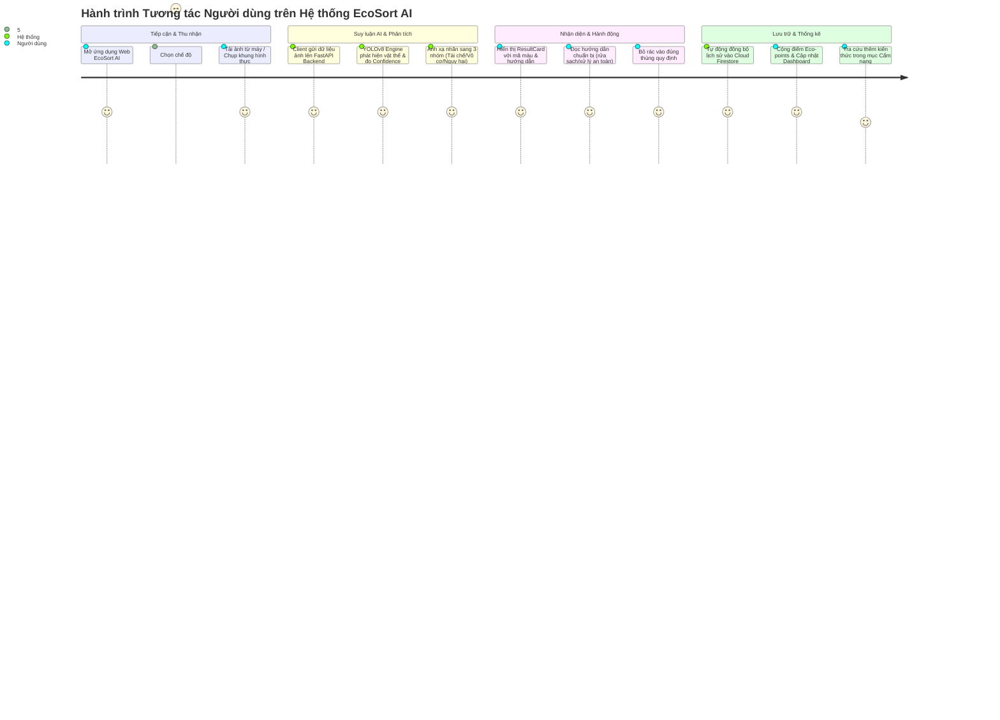

# TÀI LIỆU YÊU CẦU SẢN PHẨM (PRODUCT REQUIREMENTS DOCUMENT - PRD)

## TÊN DỰ ÁN: ECOSORT AI
### Hệ thống Phân loại Rác thải Thông minh Ứng dụng Thị giác Máy tính và Trí tuệ Nhân tạo
**Phiên bản:** 1.0.0  
**Trạng thái:** Approved / Architectural Baseline  
**Tác giả:** Senior Product Manager & AI Solutions Architect  
**Ngày phê duyệt:** 08/09/2026  
**Target Release:** Production Phase 1  

---

## 1. TỔNG QUAN SẢN PHẨM & TẦM NHÌN (PRODUCT OVERVIEW & VISION)

### 1.1. Tuyên ngôn Tầm nhìn (Vision Statement)
**EcoSort AI** được phát triển nhằm trở thành nền tảng trợ lý số thông minh hàng đầu tại Việt Nam và khu vực trong việc phân loại rác thải tại nguồn. Bằng cách kết hợp mô hình thị giác máy tính tiên tiến (**YOLOv8 Object Detection & Classification**) với kiến trúc web hiện đại (**ReactJS + FastAPI + Firebase Serverless**), hệ thống loại bỏ rào cản nhận thức của người dân, cung cấp kết quả định danh tức thì kèm chỉ dẫn hành động cụ thể, biến việc phân loại rác từ một nghĩa vụ phức tạp thành một trải nghiệm số hóa nhanh chóng, trực quan và đầy cảm hứng.

### 1.2. Mục tiêu Chiến lược & Chỉ số Thành công (Strategic OKRs)

#### Objective 1: Trở thành công cụ phân loại rác tức thời có độ chính xác cao và thân thiện nhất
* **KR 1.1:** Đạt chỉ số nhận diện toàn diện **mAP@0.5 > 88%** trên 22 phân loại rác thải sinh hoạt phổ biến.
* **KR 1.2:** Duy trì độ trễ suy luận AI của API Backend **$\le$ 80ms** trên môi trường tiêu chuẩn và thời gian phản hồi toàn trình (End-to-End Latency) **$\le$ 500ms**.
* **KR 1.3:** Đạt tỷ lệ người dùng hiểu đúng cách xử lý rác đạt trên **95%** sau khi xem màn hình kết quả phân loại.

#### Objective 2: Thúc đẩy thói quen tái chế và xây dựng dữ liệu môi trường minh bạch
* **KR 2.1:** Ghi nhận 100% các phiên quét hợp lệ vào hệ sinh thái dữ liệu lịch sử đám mây Firebase Firestore với độ sẵn sàng cao.
* **KR 2.2:** Cung cấp Dashboard thống kê trực quan thể hiện rõ tỷ lệ rác tái chế, rác thông thường và rác nguy hại, kèm công thức chuyển đổi tác động môi trường (ước tính lượng $CO_2$ giảm phát thải và điểm thưởng Eco-points).

---

## 2. CHÂN DUNG NGƯỜI DÙNG & ĐỐI TƯỢNG HƯỞNG LỢI (USER PERSONAS)

### Persona 1: Cư dân Đô thị Trẻ & Người Tiêu dùng Xanh (Primary Persona)
* **Họ tên đại diện:** Nguyễn Mai Lan (24 tuổi) - Nhân viên văn phòng sống tại chung cư Quận 7, TP.HCM.
* **Hành vi:** Thường xuyên đặt đồ ăn giao tận nơi, sử dụng nhiều bao bì nhựa, hộp xốp, chai nước giải khát. Có ý thức bảo vệ môi trường, theo dõi các lối sống bền vững (Zero-waste).
* **Nỗi đau (Pain Points):**
  * Không phân biệt được nắp chai nhựa, túi bóng bẩn, hộp giấy dính thức ăn có được tái chế hay không.
  * Tòa nhà bắt đầu kiểm tra phân loại rác theo Luật Bảo vệ Môi trường, sợ bị bảo vệ nhắc nhở hoặc phạt tiền.
  * Ngại cài đặt các ứng dụng rườm rà, muốn có công cụ mở ngay trên điện thoại là dùng được.
* **Kỳ vọng vào EcoSort AI:** Mở trang web trên Safari/Chrome, bật camera quét đồ vật trước khi ném vào thùng rác, biết ngay màu thùng cần bỏ và cách làm sạch rác tái chế trong vòng 2 giây.

### Persona 2: Trưởng Ban Quản trị & Quản lý Tòa nhà / Khu Dân cư (Admin Persona)
* **Họ tên đại diện:** Trần Quốc Tuấn (42 tuổi) - Trưởng ban Quản lý Cụm chung cư 1.200 căn hộ.
* **Hành vi:** Giám sát công tác vệ sinh môi trường, hợp đồng thu gom rác với công ty môi trường đô thị.
* **Nỗi đau (Pain Points):**
  * Rác tái chế tại chung cư bị từ chối thu gom vì lẫn quá nhiều rác hữu cơ và rác nguy hại.
  * Tốn nhiều chi phí in ấn poster tuyên truyền nhưng cư dân không đọc.
  * Thiếu dữ liệu định lượng về lượng rác phát sinh và tỷ lệ tuân thủ của cư dân để báo cáo với chính quyền địa phương.
* **Kỳ vọng vào EcoSort AI:** Hệ thống có trang Dashboard thống kê tổng số lượt quét, tỷ lệ các loại rác được phân loại trong khu dân cư để đánh giá hiệu quả chiến dịch sống xanh.

### Persona 3: Chuyên viên Môi trường & Đơn vị Thu gom Tái chế (Recycling Specialist Persona)
* **Họ tên đại diện:** TS. Đặng Minh Hòa (38 tuổi) - Cố vấn vận hành nhà máy tái chế nhựa.
* **Hành vi:** Tiếp nhận các kiện rác từ điểm tập kết đô thị, điều phối dây chuyền phân loại cơ học và hóa học.
* **Nỗi đau (Pain Points):**
  * Pin kim loại nặng, bình xịt nén khí bị ném lẫn trong kiện nhựa tái chế gây nguy cơ cháy nổ nghiền rác và hư hỏng máy móc.
  * Nhựa nhiễm bẩn làm giảm giá trị hạt nhựa tái sinh (recycled pellets) tới 60%.
* **Kỳ vọng vào EcoSort AI:** Giáo dục người dân thói quen "Rửa sạch & Ép xẹp" vỏ hộp trước khi bỏ vào thùng rác, đồng thời phát cảnh báo đỏ nghiêm ngặt đối với 6 loại rác nguy hại (Hazardous).

---

## 3. HÀNH TRÌNH NGƯỜI DÙNG (USER JOURNEYS & WORKFLOWS)



---

## 4. YÊU CẦU CHỨC NĂNG HỆ THỐNG CHI TIẾT (FUNCTIONAL REQUIREMENTS - FR)

```
┌─────────────────────────────────────────────────────────────────────────────┐
│                       DANH MỤC PHÂN HỆ CHỨC NĂNG CHÍNH                      │
├────────────────────────────────┬────────────────────────────────────────────┤
│ [FR-1] Tiếp nhận & Xử lý Ảnh   │ Thu nhận ảnh tải lên & Stream từ Webcam    │
│ [FR-2] Suy luận AI YOLOv8      │ Nhận diện 22 nhãn rác & Gán nhóm 3 màu     │
│ [FR-3] Chỉ dẫn Xử lý Rác       │ Lời khuyên tiền xử lý rác & Cảnh báo đỏ    │
│ [FR-4] Xác thực & Người dùng   │ Đăng ký, đăng nhập & Quản lý phiên Firebase│
│ [FR-5] Lịch sử & Kiểm toán     │ Lưu vết lịch sử quét rác trên Firestore    │
│ [FR-6] Dashboard & Thống kê    │ Đo lường tỷ lệ rác, CO2 & Điểm Eco-points │
│ [FR-7] Cẩm nang Phân loại Rác  │ Bách khoa tra cứu chi tiết 22 phân loại    │
└────────────────────────────────┴────────────────────────────────────────────┘
```

### 4.1. Phân hệ FR-1: Tiếp nhận & Tiền xử lý Ảnh (Image Ingestion & Preprocessing)
* **FR-1.1:** Hỗ trợ tải tệp ảnh từ máy tính hoặc điện thoại với các định dạng tiêu chuẩn: `.jpg`, `.jpeg`, `.png`, `.webp`. Kích thước tệp tối đa: **10 MB**.
* **FR-1.2:** Hỗ trợ kéo - thả (Drag-and-drop) ảnh trực tiếp vào khung tải lên hoặc nhấp để mở File Picker.
* **FR-1.3:** Tích hợp camera chụp hình trực tiếp (Webcam Scanner) sử dụng thư viện `react-webcam` tương thích chuẩn HTML5 MediaDevices API, cho phép xem trước luồng video thời gian thực và nhấn nút "Chụp & Nhận diện".
* **FR-1.4:** Kiểm tra tính hợp lệ của tệp ảnh tại Client (Client-side validation): Từ chối tệp không đúng định dạng ảnh hoặc tệp rỗng với thông báo lỗi trực quan.

### 4.2. Phân hệ FR-2: Dịch vụ Suy luận AI & Phân loại Vật thể (AI Inference Engine)
* **FR-2.1:** Cung cấp RESTful Endpoint `POST /api/predict` tiếp nhận payload dạng `multipart/form-data` chứa file ảnh.
* **FR-2.2:** Xử lý ảnh tại Backend bằng OpenCV và Pillow: Đọc binary stream, chuyển đổi không gian màu RGB sang BGR, nắn kích thước theo chuẩn đầu vào của mô hình.
* **FR-2.3:** Sử dụng mô hình **YOLOv8** (`best.pt` / `best.onnx`) được huấn luyện chuyên biệt trên tập dữ liệu rác thải gồm **22 classes**, trích xuất bounding box có độ tin cậy cao nhất:
  * Lấy `cls_id` và tính toán `confidence = float(boxes[0].conf[0]) * 100`.
  * Áp dụng ngưỡng lọc tin cậy cơ sở: `conf >= 0.50` (50%).
* **FR-2.4:** Ánh xạ nhãn phát hiện được sang một trong 3 nhóm xử lý chuẩn mực:
  * **RECYCLABLE (Rác Tái chế):** Gồm 5 classes (`cardboard_box`, `can`, `plastic_bottle_cap`, `plastic_bottle`, `reuseable_paper`). Mã màu định danh: `#22c55e` (Xanh lục lá).
  * **NON_RECYCLABLE (Rác Không tái chế / Sinh hoạt):** Gồm 11 classes (`plastic_bag`, `scrap_paper`, `stick`, `plastic_cup`, `snack_bag`, `plastic_box`, `straw`, `plastic_cup_lid`, `scrap_plastic`, `cardboard_bowl`, `plastic_cultery`). Mã màu định danh: `#64748b` (Xám than).
  * **HAZARDOUS (Rác Nguy hại):** Gồm 6 classes (`battery`, `chemical_spray_can`, `chemical_plastic_bottle`, `chemical_plastic_gallon`, `light_bulb`, `paint_bucket`). Mã màu định danh: `#ef4444` (Đỏ cảnh báo).
* **FR-2.5:** Fallback cơ chế: Nếu mô hình không phát hiện được bounding box nào thỏa mãn ngưỡng tin cậy, trả về đối tượng phản hồi chuẩn:
  * `class`: "Không nhận diện được"
  * `type`: "UNKNOWN"
  * `confidence`: 0
  * `color`: `#64748b`
  * `guide`: "Vui lòng chụp lại ảnh rõ nét hơn, đưa vật thể vào trung tâm khung hình và đảm bảo đủ ánh sáng."

### 4.3. Phân hệ FR-3: Chỉ dẫn Hành vi Xử lý Rác (Disposal Guidance & Educational Context)
* **FR-3.1:** Hiển thị thẻ kết quả (`ResultCard`) trực quan gồm: Nhãn phân loại tiếng Việt, Nhóm rác lớn, Thanh phần trăm độ tin cậy AI, và Huy hiệu màu tương ứng.
* **FR-3.2:** Hiển thị cẩm nang hành động tức thời tùy theo nhóm rác:
  * *Rác tái chế:* Hướng dẫn tráng sạch thức ăn thừa, phơi khô, ép xẹp chai nhựa/lon nhôm để tiết kiệm thể tích trước khi bỏ vào thùng tái chế.
  * *Rác không tái chế:* Hướng dẫn bỏ vào túi đựng rác sinh hoạt thông thường, buộc chặt miệng túi.
  * *Rác nguy hại:* Cảnh báo an toàn cấp cao - Không đập vỡ bóng đèn, không chọc thủng bình xịt, bọc cách điện cực pin và mang đến điểm thu gom chất thải nguy hại chuyên biệt.

### 4.4. Phân hệ FR-4: Xác thực & Quản lý Người dùng (Authentication & Identity)
* **FR-4.1:** Cho phép người dùng đăng ký tài khoản mới bằng Email và Mật khẩu (mã hóa chuẩn Firebase Authentication).
* **FR-4.2:** Đăng nhập an toàn, duy trì phiên làm việc bằng Token với `onAuthStateChanged`.
* **FR-4.3:** Hỗ trợ chế độ Quét vãng lai (Guest Mode): Người dùng chưa đăng nhập vẫn có thể sử dụng đầy đủ tính năng quét rác AI và tra cứu cẩm nang.

### 4.5. Phân hệ FR-5: Nhật ký Lịch sử & Kiểm toán Hoạt động (Scan History & Audit Log)
* **FR-5.1:** Khi người dùng đã đăng nhập thực hiện quét rác thành công, hệ thống tự động ghi nhận một bản ghi vào Collection `history` trên Cloud Firestore gồm:
  * `userId`: Mã định danh người dùng.
  * `className`: Tên lớp vật thể được phát hiện.
  * `wasteType`: Nhóm phân loại (`RECYCLABLE`, `NON_RECYCLABLE`, `HAZARDOUS`).
  * `confidence`: Điểm số tin cậy (%).
  * `guide`: Chỉ dẫn xử lý đã hiển thị.
  * `createdAt`: Dấu thời gian chuẩn máy chủ (`serverTimestamp()`).
* **FR-5.2:** Trang Lịch sử (`History.jsx`) hiển thị danh sách các lần phân loại theo thứ tự thời gian giảm dần, có phân biệt thẻ màu theo từng nhóm rác.
* **FR-5.3:** Cho phép người dùng làm mới dữ liệu lịch sử hoặc xóa từng mục ghi nhận nếu muốn.

### 4.6. Phân hệ FR-6: Bảng điều khiển Thống kê Môi trường (Environmental Analytics Dashboard)
* **FR-6.1:** Tổng hợp số liệu từ Firestore hiển thị trên trang Thống kê (`Statistics.jsx`):
  * Tổng số lượt quét rác (Total Scans).
  * Số lượng và tỷ lệ % phân bổ của 3 nhóm rác.
  * Lượng rác tái chế đã được phân loại đúng cách.
* **FR-6.2:** Hiển thị biểu đồ phân bổ trực quan (Pie/Bar Chart) phản ánh thói quen tiêu dùng rác thải của người dùng.
* **FR-6.3:** Tính toán chỉ số Tác động Xanh:
  * Ước lượng lượng khí nhà kính giảm phát thải tương đương ($kg CO_2e$).
  * Điểm tích lũy thói quen xanh (Eco-points): Cộng 10 điểm cho mỗi rác tái chế, 2 điểm cho rác sinh hoạt, 15 điểm cho việc xử lý đúng rác nguy hại.
* **FR-6.4:** Bảng xếp hạng / Thống kê tổng hợp hệ thống dành cho Quản trị viên (Admin View).

### 4.7. Phân hệ FR-7: Cẩm nang Phân loại Rác Thông minh (Waste Knowledge Base & Guide)
* **FR-7.1:** Trang Cẩm nang (`Guide.jsx`) hiển thị bách khoa toàn thư 22 phân loại rác chi tiết chia theo từng thẻ trực quan (`GuideCard.jsx`).
* **FR-7.2:** Cung cấp bộ lọc theo Tab danh mục: Tất cả, Rác Tái Chế, Rác Không Tái Chế, Rác Nguy Hại.
* **FR-7.3:** Hỗ trợ thanh tìm kiếm tức thời (Search Bar) lọc theo tên loại rác với kỹ thuật lọc không phân biệt hoa thường.

---

## 5. YÊU CẦU PHI CHỨC NĂNG HỆ THỐNG (NON-FUNCTIONAL REQUIREMENTS - NFR)

### 5.1. NFR-1: Hiệu năng & Tốc độ Phản hồi (Performance & Latency)
* **NFR-1.1 (AI Inference Latency):** Thời gian suy luận của mô hình YOLOv8 trên máy chủ đối với một khung hình ảnh không được vượt quá **80ms** (CPU) và **25ms** (GPU).
* **NFR-1.2 (End-to-End Latency):** Tổng thời gian từ lúc người dùng nhấn nút "Phân loại rác" đến khi hiển thị kết quả trên giao diện không vượt quá **500ms** trong điều kiện mạng tiêu chuẩn.
* **NFR-1.3 (Client Render Performance):** Luồng video Webcam duy trì tốc độ khung hình từ **30fps** trở lên, giao diện người dùng không bị giật lag (Zero-jank UI, 60fps khi cuộn trang).

### 5.2. NFR-2: Độ chính xác & Tin cậy AI (Accuracy & Model Robustness)
* **NFR-2.1 (Precision & Recall):** Độ chính xác trung bình (mAP@0.5) của mô hình phải đạt tối thiểu **88%** trên tập kiểm thử độc lập (validation dataset).
* **NFR-2.2 (Safety Strictness):** Độ nhạy (Recall) đối với nhóm Rác Nguy hại (HAZARDOUS) phải đạt tối thiểu **92%** để tuyệt đối hạn chế tình trạng bỏ sót rác độc hại vào rác sinh hoạt thông thường.

### 5.3. NFR-3: Khả năng Mở rộng & Tính Sẵn sàng (Scalability & Availability)
* **NFR-3.1:** Kiến trúc Backend FastAPI bất đồng bộ (`async def`) cho phép xử lý đồng thời tối thiểu **50 requests/giây (RPS)** trên một phiên bản máy chủ tiêu chuẩn mà không làm nghẽn tiến trình.
* **NFR-3.2:** Độ khả dụng của hệ thống đạt mức **99.5%** thời gian hoạt động (Uptime) hàng tháng.

### 5.4. NFR-4: An toàn Thông tin & Quyền Riêng tư (Security & Privacy)
* **NFR-4.1 (Privacy-first Image Handling):** Ảnh tải lên phục vụ suy luận không lưu giữ vĩnh viễn trên máy chủ nếu không có sự đồng ý của người dùng. Thư mục tạm `uploads/` định kỳ được dọn dẹp để đảm bảo quyền riêng tư.
* **NFR-4.2 (Secure Transport):** Mọi luồng truyền tải dữ liệu giữa Client và Backend được mã hóa bắt buộc qua HTTPS (TLS 1.2+).
* **NFR-4.3 (CORS & Input Sanitization):** Backend áp dụng chính sách CORS chặt chẽ, chỉ tiếp nhận yêu cầu từ domain frontend được ủy quyền, đồng thời kiểm tra magic bytes của file ảnh ngăn chặn chèn mã độc.

### 5.5. NFR-5: Khả năng Tương thích & Trải nghiệm (Usability & Compatibility)
* **NFR-5.1:** Giao diện Responsive hoàn hảo trên mọi kích thước màn hình: Điện thoại thông minh (iOS Safari, Android Chrome), Máy tính bảng, và Máy tính cá nhân (Desktop).
* **NFR-5.2:** Hỗ trợ đầy đủ ngôn ngữ hiển thị tiếng Việt chuẩn mực, thông điệp rõ ràng, thuật ngữ dễ hiểu với mọi tầng lớp người dân.

---

## 6. MA TRẬN PHÂN LOẠI 22 LỚP RÁC CHUẨN MỰC (CLASS MAPPING MATRIX)

Hệ thống quản lý thống nhất 22 lớp định danh (classes) từ bộ dữ liệu rác thải, ánh xạ trực tiếp sang 3 nhóm môi trường:

| STT | Class ID | Tên Lớp Mô Hình | Tên Tiếng Việt | Nhóm Phân Loại | Mã Màu Hex | Chỉ Dẫn Hành Động Cụ Thể |
| :---: | :---: | :--- | :--- | :--- | :---: | :--- |
| 1 | 0 | `cardboard_box` | Thùng carton | **RECYCLABLE** | `#22c55e` | Gấp dẹp thùng, giữ khô ráo, bỏ vào thùng tái chế. |
| 2 | 1 | `can` | Lon kim loại (nhôm/sắt) | **RECYCLABLE** | `#22c55e` | Rửa sạch cặn nước ngọt/bia, ép xẹp và bỏ vào thùng tái chế. |
| 3 | 2 | `plastic_bottle_cap` | Nắp chai nhựa | **RECYCLABLE** | `#22c55e` | Tháo rời khỏi chai, rửa sạch và bỏ vào túi rác tái chế. |
| 4 | 3 | `plastic_bottle` | Chai nhựa (PET/HDPE) | **RECYCLABLE** | `#22c55e` | Đổ hết nước, xúc sạch, bóp xẹp tiết kiệm diện tích. |
| 5 | 4 | `reuseable_paper` | Giấy có thể tái chế | **RECYCLABLE** | `#22c55e` | Giữ giấy phẳng phiu, không để dính dầu mỡ, gom thành xấp. |
| 6 | 5 | `plastic_bag` | Túi nilon | **NON_RECYCLABLE** | `#64748b` | Buộc gọn lại, bỏ vào thùng rác sinh hoạt vô cơ. |
| 7 | 6 | `scrap_paper` | Giấy vụn / giấy dơ | **NON_RECYCLABLE** | `#64748b` | Giấy dính dầu mỡ không tái chế được, bỏ vào rác sinh hoạt. |
| 8 | 7 | `stick` | Que gỗ / que kem | **NON_RECYCLABLE** | `#64748b` | Bỏ vào thùng rác sinh hoạt thông thường. |
| 9 | 8 | `plastic_cup` | Cốc nhựa dùng một lần | **NON_RECYCLABLE** | `#64748b` | Đổ bỏ đá lạnh và nước thừa, vứt vào rác sinh hoạt. |
| 10 | 9 | `snack_bag` | Vỏ bánh kẹo / bim bim | **NON_RECYCLABLE** | `#64748b` | Bao bì phức hợp màng nhôm/nhựa, bỏ thùng rác sinh hoạt. |
| 11 | 10 | `plastic_box` | Hộp nhựa xốp / định hình | **NON_RECYCLABLE** | `#64748b` | Hộp xốp đựng cơm dính dầu mỡ, vứt vào thùng rác sinh hoạt. |
| 12 | 11 | `straw` | Ống hút nhựa | **NON_RECYCLABLE** | `#64748b` | Bỏ vào thùng rác sinh hoạt; khuyến khích dùng ống hút inox. |
| 13 | 12 | `plastic_cup_lid` | Nắp cốc nhựa mang đi | **NON_RECYCLABLE** | `#64748b` | Bỏ vào thùng rác sinh hoạt. |
| 14 | 13 | `scrap_plastic` | Mảnh nhựa vỡ vụn | **NON_RECYCLABLE** | `#64748b` | Gói cẩn thận tránh làm rách bao rác sinh hoạt. |
| 15 | 14 | `cardboard_bowl` | Tô giấy thức ăn | **NON_RECYCLABLE** | `#64748b` | Tô giấy tráng màng chống thấm dầu mỡ, bỏ rác sinh hoạt. |
| 16 | 15 | `plastic_cultery` | Dao thìa dĩa nhựa | **NON_RECYCLABLE** | `#64748b` | Đồ nhựa dùng một lần, bỏ vào rác sinh hoạt thông thường. |
| 17 | 16 | `battery` | Pin các loại | **HAZARDOUS** | `#ef4444` | **NGUY HẠI:** Dán băng dính 2 cực, gom nộp tại điểm thu gom pin. |
| 18 | 17 | `chemical_spray_can` | Bình xịt hóa chất | **HAZARDOUS** | `#ef4444` | **NGUY HẠI:** Bình nén khí dễ nổ, không đập vỡ, giao xử lý riêng. |
| 19 | 18 | `chemical_plastic_bottle` | Chai lọ đựng hóa chất | **HAZARDOUS** | `#ef4444` | **NGUY HẠI:** Đậy chặt nắp, không xúc rửa ra cống rãnh công cộng. |
| 20 | 19 | `chemical_plastic_gallon` | Can nhựa hóa chất lớn | **HAZARDOUS** | `#ef4444` | **NGUY HẠI:** Bàn giao cho đơn vị xử lý chất thải công nghiệp. |
| 21 | 20 | `light_bulb` | Bóng đèn huỳnh quang/LED | **HAZARDOUS** | `#ef4444` | **NGUY HẠI:** Chứa thủy ngân; bọc giấy mềm tránh vỡ, giao cơ sở gom. |
| 22 | 21 | `paint_bucket` | Thùng vỏ sơn | **HAZARDOUS** | `#ef4444` | **NGUY HẠI:** Chứa chì và dung môi độc; thu gom theo luồng độc hại. |

---

## 7. KẾ HOẠCH PHÁT HÀNH & LỘ TRÌNH SẢN PHẨM (RELEASE ROADMAP)

```text
2026-Q1 (Hoàn thành)      2026-Q2 (Hiện tại)           2026-Q3 (Mở rộng)            2026-Q4 (Tương lai)
┌───────────────────────┐  ┌────────────────────────┐  ┌─────────────────────────┐  ┌───────────────────────┐
│ GIAI ĐOẠN 1: POC      │  │ GIAI ĐOẠN 2: MVP WEB   │  │ GIAI ĐOẠN 3: REALTIME   │  │ GIAI ĐOẠN 4: IOT SMART│
│ - Thu thập dữ liệu    │  │ - Ứng dụng React+Vite  │  │ - Nhận diện Video Stream│  │ - Tích hợp Edge Camera│
│ - Train YOLOv8 22 cls │  │ - FastAPI REST Engine  │  │   liên tục (Bounding Box)│  │   trên thùng rác thật │
│ - Đạt mAP > 88%       │  │ - Firebase History/Auth│  │ - Đổi quà Eco-Rewards   │  │ - Tự động mở nắp thùng│
│ - Xác thực kiểm thử   │  │ - Dashboard thống kê   │  │ - Bảng xếp hạng xã hội  │  │ - Triển khai SmartCity│
└───────────────────────┘  └────────────────────────┘  └─────────────────────────┘  └───────────────────────┘
```

---

## 8. QUẢN TRỊ RỦI RO SẢN PHẨM (PRODUCT RISK MATRIX)

| Rủi ro Tiềm ẩn | Mức độ | Khả năng | Chiến lược Giảm thiểu & Phòng ngừa (Mitigation) |
| :--- | :---: | :---: | :--- |
| **Nhận diện sai rác Nguy hại thành Rác Tái chế** | Nghiêm trọng | Thấp | Cài đặt ngưỡng tin cậy riêng biệt cho nhóm Hazardous; thêm nút "Báo cáo nhận diện sai" để người dùng phản hồi. |
| **Ảnh chụp quá mờ, thiếu sáng, góc chụp che khuất** | Trung bình | Cao | Hiển thị màn hình fallback yêu cầu người dùng chụp lại kèm gợi ý căn chỉnh góc chụp và độ sáng. |
| **Quá tải tài nguyên khi lượng ảnh gửi liên tục** | Cao | Trung bình | Tối ưu hóa pipeline xử lý ảnh bằng OpenCV C-bindings, chạy tiến trình bất đồng bộ Uvicorn, cấu hình giới hạn kích thước tệp tải lên. |
| **Người dùng từ chối quyền cấp Webcam** | Thấp | Trung bình | Cung cấp ngay phương án dự phòng chuyển sang kéo thả ảnh hoặc tải file mà không làm gián đoạn luồng sử dụng. |
