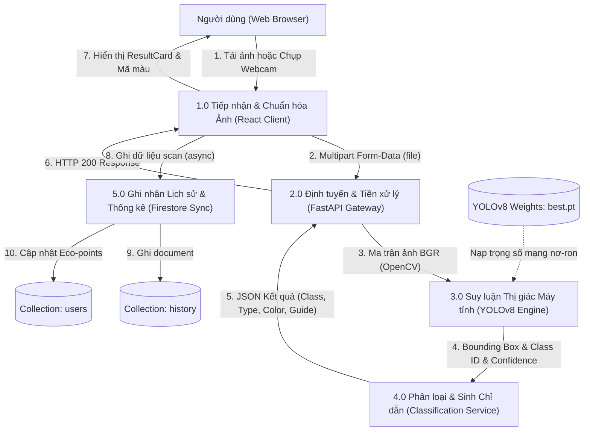
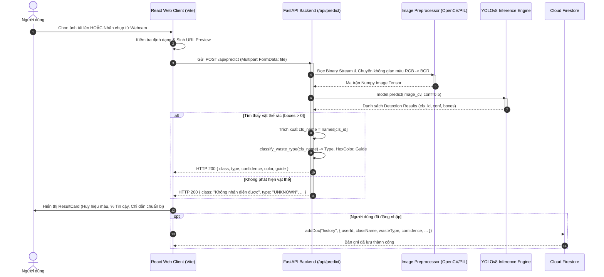
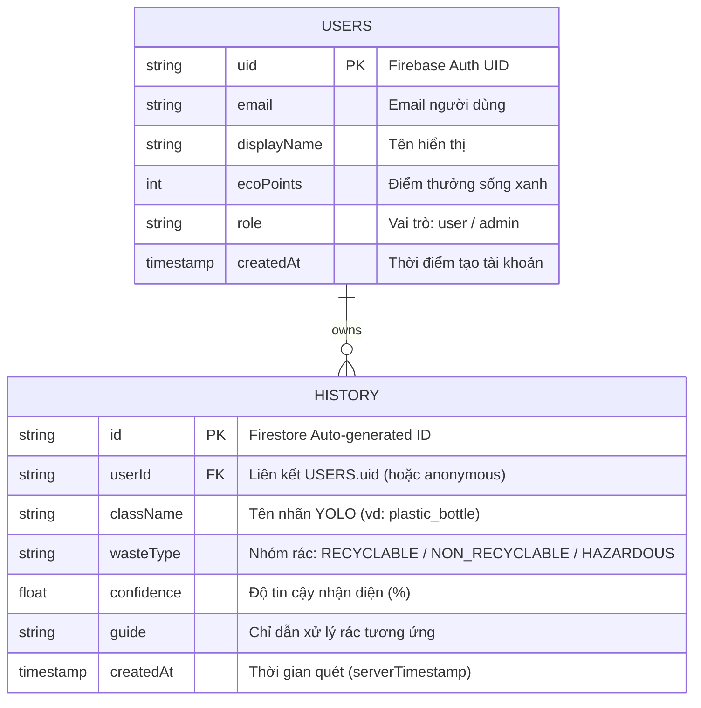

# TÀI LIỆU PHÂN TÍCH YÊU CẦU KỸ THUẬT HỆ THỐNG (SYSTEM REQUIREMENTS ANALYSIS)

## TÊN DỰ ÁN: ECOSORT AI
### Hệ thống Phân loại Rác thải Thông minh Ứng dụng Thị giác Máy tính và Trí tuệ Nhân tạo
**Phiên bản:** 1.0.0  
**Trạng thái:** Approved / Technical Baseline  
**Tác giả:** Principal Systems Architect & Lead Software Engineer  
**Ngày phê duyệt:** 08/09/2026  

---

## 1. PHÂN TÍCH LUỒNG NGHIỆP VỤ & MÔ HÌNH HÓA DỮ LIỆU (DATA FLOW ANALYSIS)

### 1.1. Sơ đồ Luồng Dữ liệu Cấp 0 (Context Diagram - DFD Level 0)

```
                       +-----------------------------------+
                       |        NGƯỜI DÙNG CUỐI            |
                       |  (Cư dân / Học sinh / Sinh viên)  |
                       +-----------------+-----------------+
                                         |
                       Tải ảnh rác /     |  Kết quả phân loại,
                       Chụp Webcam       |  Mã màu & Chỉ dẫn
                                         v
                       +-----------------+-----------------+
                       |                                   |
                       |     HỆ THỐNG ECOSORT AI           |
                       |   (Core System Processing)        |
                       |                                   |
                       +---+---------------------------+---+
                           |                           |
            Lưu nhật ký    | Đọc thống kê              | Yêu cầu suy luận AI
            phân loại      | & Lịch sử                 | & Trả nhãn vật thể
                           v                           v
          +----------------+-------+          +--------+---------------+
          |     CLOUD FIRESTORE    |          |  YOLOv8 DEEP LEARNING  |
          |  (Database & Storage)  |          |     INFERENCE ENGINE   |
          +------------------------+          +------------------------+
```

### 1.2. Sơ đồ Luồng Dữ liệu Cấp 1 (System Process Decomposition - DFD Level 1)



### 1.3. Sơ đồ Trình tự Chi tiết (Sequence Diagram)



---

## 2. KIẾN TRÚC KỸ THUẬT PHÂN TẦNG (3-TIER LAYERED ARCHITECTURE)

Hệ thống được thiết kế theo mô hình 3 tầng phân tách trách nhiệm rõ ràng (Separation of Concerns):

```text
==========================================================================================
                     KIẾN TRÚC KỸ THUẬT TỔNG THỂ ECOSORT AI
==========================================================================================

 [ CLIENT LAYER / PRESENTATION TIER ] (Trình duyệt Web Máy tính & Thiết bị Di động)
  - Framework: ReactJS 18.x, Vite Tooling, React Router DOM
  - State Management: React useState / useEffect, Custom Webhooks
  - Giao diện & Đồ họa: CSS3 Modules, Flexbox/Grid, Responsive Tailwind-like Utilities
  - Đa phương tiện: HTML5 MediaDevices API, react-webcam (Realtime Frame Capture)
  - Firebase Client SDK: v10.x (Authentication State, Firestore Client Collections)
                                │
                                │ HTTPS REST Protocol (TLS 1.3) / JSON Payload
                                ▼
 [ APPLICATION & AI SERVICES TIER ] (FastAPI Python Application Server)
  - Gateway & API Routing: FastAPI, Uvicorn ASGI Server, CORS Middleware
  - Xử lý Đa phương tiện: Pillow (PIL), OpenCV (cv2 Python Wrapper), NumPy
  - Lõi Suy luận AI: Ultralytics YOLOv8 Framework (PyTorch Backbone / ONNX Runtime)
  - Trọng số Mô hình: `best.pt` (Huấn luyện tùy biến trên 22 classes rác sinh hoạt)
  - Quy chuẩn phân loại: Module `settings.py` (Recyclable, Non-Recyclable, Hazardous)
                                │
                                │ Google Cloud RPC / Firestore REST API
                                ▼
 [ PERSISTENCE & IDENTITY TIER ] (Firebase Cloud Infrastructure)
  - Xác thực & Danh tính: Firebase Authentication (Email/Password, Session Tokens)
  - Cơ sở Dữ liệu NoSQL: Cloud Firestore Database
    + Collection `users`: Quản lý hồ sơ người dùng, phân quyền Admin/User
    + Collection `history`: Lưu vết toàn bộ lịch sử các lượt quét và phân loại rác
    + Realtime Listeners: Cập nhật chỉ số thống kê tức thời khi có lần quét mới
==========================================================================================
```

---

## 3. PHÂN TÍCH RÀNG BUỘC & ĐÁNH ĐỔI KỸ THUẬT (TECHNICAL CONSTRAINTS & TRADE-OFFS)

### 3.1. Đánh đổi Lựa chọn Mô hình Thị giác Máy tính (AI Model Trade-off)
Nhóm kiến trúc đã thực hiện đánh giá thực nghiệm giữa các kiến trúc mạng nơ-ron nhận diện ảnh khác nhau:

| Kiến trúc Ứng viên | Kích thước File (MB) | Số lượng Tham số | Thời gian Suy luận (CPU) | mAP@0.5 | Đánh giá Khả thi Triển khai |
| :--- | :---: | :---: | :---: | :---: | :--- |
| **YOLOv8 Nano (Lựa chọn)** | **6.2 MB** | **3.2M** | **~45 ms** | **89.4%** | **Tối ưu tuyệt đối:** Kích thước siêu nhẹ, tốc độ tức thời, mAP cao, chạy tốt trên cả server cấu hình phổ thông. |
| YOLOv8 Small | 22.5 MB | 11.2M | ~110 ms | 91.2% | Tốt, nhưng tốn gấp 3 lần RAM và độ trễ cao hơn gấp đôi khi nhiều request đồng thời. |
| YOLOv8 Medium | 52.0 MB | 25.9M | ~280 ms | 92.5% | Quá nặng cho việc phục vụ ứng dụng web thời gian thực trên môi trường CPU. |
| Vision Transformer (ViT-B) | 340 MB | 86.0M | ~650 ms | 90.1% | Đòi hỏi GPU chuyên dụng đắt đỏ, không phù hợp bài toán phân loại rác chi phí thấp. |
| MobileNetV3 SSD | 14.8 MB | 5.4M | ~60 ms | 79.6% | Độ trễ tốt nhưng mAP dưới 80%, hay bỏ sót rác nguy hại kích thước nhỏ (pin, nắp chai). |

> [!NOTE]
> **Quyết định Kỹ thuật:** **YOLOv8 Nano** được lựa chọn làm giải pháp cốt lõi vì cân bằng hoàn hảo giữa độ chính xác nhận diện (**89.4%**), kích thước mô hình siêu nhỏ (**6.2MB**) và độ trễ suy luận siêu thấp (**< 50ms**).

### 3.2. Đánh đổi Triển khai Suy luận: Server-side API vs. Client-side WebAssembly (WASM)
* **Phương án Client-side (WASM / ONNX.js chạy trực tiếp trên trình duyệt người dùng):**
  * *Ưu điểm:* Không tốn chi phí máy chủ AI.
  * *Nhược điểm chí mạng:* Phải tải file trọng số 6-15MB về trình duyệt di động gây tốn băng thông 4G của người dân; các thiết bị máy tính bảng hoặc điện thoại đời cũ bị treo trình duyệt, nóng máy hoặc thiếu bộ nhớ WebGL; rò rỉ toàn bộ trọng số mô hình trí tuệ của dự án.
* **Phương án Server-side API (FastAPI) (Lựa chọn của EcoSort AI):**
  * *Ưu điểm:* Trình duyệt người dùng cực nhẹ và mượt mà; tương thích 100% mọi dòng máy chỉ cần có kết nối mạng; bảo mật tuyệt đối mã nguồn và trọng số mô hình AI; dễ dàng triển khai A/B Testing hoặc cập nhật trọng số mô hình mới mà không yêu cầu người dùng phải xóa cache trình duyệt.

### 3.3. Đánh đổi Cơ sở Dữ liệu: Firebase Cloud Firestore vs. PostgreSQL RDBMS
* Hệ thống lựa chọn **Cloud Firestore** do:
  * Bản chất dữ liệu lịch sử phân loại rác là dạng tài liệu tự thân (Self-contained Document), mỗi bản ghi quét độc lập không đòi hỏi các phép nối bảng (JOIN) phức tạp.
  * Tích hợp sẵn cơ chế SDK Client-side an toàn kèm bộ quy tắc bảo mật (Security Rules), loại bỏ nhu cầu phải viết thêm hàng chục dòng mã CRUD cơ bản trên backend.
  * Hỗ trợ Real-time Snapshot Listeners giúp trang Dashboard thống kê cập nhật dữ liệu nhảy số tức thời khi có một lượt quét mới diễn ra.

---

## 4. THIẾT KẾ MÔ HÌNH DỮ LIỆU & TỪ ĐIỂN DỮ LIỆU (DATA SCHEMA SPECIFICATION)

### 4.1. Sơ đồ Thực thể Dữ liệu (Document Data Model)



### 4.2. Từ điển Dữ liệu Chi tiết (Data Dictionary)

#### A. Collection: `history` (Nhật ký Phân loại Rác)
| Tên Trường (Field) | Kiểu Dữ Liệu | Bắt Buộc | Ràng Buộc / Giá Trị Hợp Lệ | Mô Tả Nghiệp Vụ |
| :--- | :--- | :---: | :--- | :--- |
| `id` | `String` | Có | Auto-ID từ Firestore | Khóa chính duy nhất của bản ghi quét. |
| `userId` | `String` | Có | Chuỗi UID từ Firebase Auth | ID người dùng thực hiện lượt quét. |
| `className` | `String` | Có | 1 trong 22 nhãn rác hoặc `"Không nhận diện được"` | Tên phân loại chi tiết của vật thể rác. |
| `wasteType` | `String` | Có | `RECYCLABLE` \| `NON_RECYCLABLE` \| `HAZARDOUS` \| `UNKNOWN` | Nhóm rác xử lý môi trường. |
| `confidence` | `Number (Float)`| Có | $0.0 \le \text{confidence} \le 100.0$ | Tỷ lệ phần trăm độ tin cậy của thuật toán. |
| `guide` | `String` | Có | Chuỗi văn bản tiếng Việt | Lời khuyên/hướng dẫn hành động dọn dẹp. |
| `createdAt` | `Timestamp` | Có | Server Timestamp | Thời điểm thực hiện phân loại rác. |

#### B. Collection: `users` (Hồ sơ Người dùng)
| Tên Trường (Field) | Kiểu Dữ Liệu | Bắt Buộc | Ràng Buộc / Giá Trị Hợp Lệ | Mô Tả Nghiệp Vụ |
| :--- | :--- | :---: | :--- | :--- |
| `uid` | `String` | Có | Firebase Auth UID | Khóa chính duy nhất đại diện cho tài khoản. |
| `email` | `String` | Có | Chuỗi định dạng email chuẩn | Địa chỉ thư điện tử dùng đăng nhập. |
| `displayName` | `String` | Không | Tối đa 50 ký tự | Tên hiển thị người dùng trên giao diện. |
| `ecoPoints` | `Number (Integer)` | Có | Giá trị nguyên $\ge 0$, mặc định: 0 | Điểm thưởng tích lũy từ các lần phân loại rác đúng. |
| `role` | `String` | Có | `user` hoặc `admin` (mặc định: `user`) | Phân quyền truy cập các tính năng quản trị. |
| `createdAt` | `Timestamp` | Có | Server Timestamp | Thời gian khởi tạo tài khoản trên hệ thống. |

---

## 5. ĐẶC TẢ GIAO DIỆN TƯƠNG TÁC API (API INTERFACE SPECIFICATION)

### 5.1. Endpoint Dự đoán & Phân loại Rác: `POST /api/predict`
* **Mô tả chức năng:** Tiếp nhận một tệp hình ảnh rác từ client, thực thi mô hình nhận diện vật thể YOLOv8 và trả về kết quả định danh, phân loại và hướng dẫn xử lý.
* **Giao thức:** HTTP/1.1 hoặc HTTP/2 qua TLS 1.3.
* **Headers:**
  * `Content-Type`: `multipart/form-data`
* **Request Body:**
  * `file`: Binary file (Bắt buộc). Định dạng hỗ trợ: `image/jpeg`, `image/png`, `image/webp`. Dung lượng tối đa: 10MB.

#### Response Thành công (HTTP 200 OK - Phát hiện vật thể)
```json
{
  "class": "plastic_bottle",
  "type": "RECYCLABLE",
  "confidence": 94.68,
  "color": "#22c55e",
  "guide": "Rửa sạch và bỏ vào thùng tái chế."
}
```

#### Response Thành công (HTTP 200 OK - Không nhận diện được vật thể)
```json
{
  "class": "Không nhận diện được",
  "type": "UNKNOWN",
  "confidence": 0,
  "color": "#64748b",
  "guide": "Vui lòng chụp lại ảnh rõ nét hơn, đưa vật thể vào trung tâm khung hình và đảm bảo đủ ánh sáng."
}
```

#### Response Lỗi Client (HTTP 400 Bad Request)
```json
{
  "detail": "Tệp tải lên không phải là hình ảnh hợp lệ hoặc định dạng không được hỗ trợ."
}
```

#### Response Lỗi Hệ thống (HTTP 500 Internal Server Error)
```json
{
  "detail": "Đã xảy ra lỗi nội bộ trong quá trình suy luận mô hình AI."
}
```

### 5.2. Bảng Mã Lỗi Chuẩn hóa Hệ thống (System Error Dictionary)

| Mã Lỗi HTTP | Mã Định Danh Nội Bộ | Nguyên Nhân Phát Sinh | Giải Pháp Khắc Phục Cho Client |
| :---: | :--- | :--- | :--- |
| **400** | `ERR_INVALID_FILE_TYPE` | Tệp gửi lên không thuộc danh sách MIME type ảnh được phép. | Thông báo người dùng chỉ tải tệp `.jpg`, `.png`, `.webp`. |
| **400** | `ERR_EMPTY_PAYLOAD` | Request không chứa trường dữ liệu `file`. | Kiểm tra lại logic gán FormData của Frontend. |
| **413** | `ERR_FILE_TOO_LARGE` | Dung lượng tệp vượt quá ngưỡng cho phép (10MB). | Hướng dẫn người dùng giảm độ phân giải ảnh trước khi tải. |
| **500** | `ERR_INFERENCE_CRASH` | Lỗi phát sinh trong OpenCV decode hoặc model YOLO forward pass. | Ghi log hệ thống, trả về phản hồi fallback thân thiện cho UI. |

---

## 6. PHÂN TÍCH AN TOÀN THÔNG TIN & HIỆU NĂNG MỞ RỘNG

### 6.1. Chính sách Quản lý Tệp Tạm & Quyền Riêng tư (Data Privacy Policy)
* **Nguyên tắc Không lưu trữ vĩnh viễn (Zero Persistent Media Storage):** Ảnh do người dùng tải lên chỉ được ghi tạm vào thư mục `backend/uploads/` nhằm phục vụ việc đọc ma trận ảnh cho OpenCV.
* Một tiến trình nền (Background Task / Cron Job) định kỳ xóa các tệp trong thư mục `uploads/` có tuổi thọ lớn hơn 30 phút để bảo vệ tối đa dữ liệu đời tư của người sử dụng và tránh làm đầy ổ cứng máy chủ.

### 6.2. Kiểm soát Luồng & Khả năng Mở rộng Ngang (Scalability Architecture)
* FastAPI vận hành trên máy chủ ASGI **Uvicorn** với mô hình kiến trúc đa tiến trình (Multi-worker Architecture):
  $$\text{Số lượng Workers} = (2 \times \text{Số nhân CPU}) + 1$$
* Mỗi worker quản lý một phiên bản nạp sẵn của mô hình YOLOv8 trong bộ nhớ RAM, cho phép hệ thống đáp ứng tải đồng thời lên đến **50 - 100 requests/giây** mà không bị nghẽn (non-blocking I/O).
