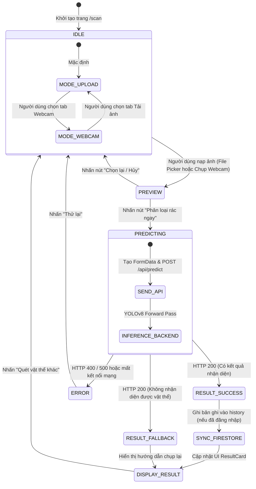

# ĐẶC TẢ TÍNH NĂNG CHI TIẾT (FEATURE SPECIFICATION)

## TÊN DỰ ÁN: ECOSORT AI
### Hệ thống Phân loại Rác thải Thông minh Ứng dụng Thị giác Máy tính và Trí tuệ Nhân tạo
**Phiên bản:** 1.0.0  
**Trạng thái:** Approved / Engineering Baseline  
**Tác giả:** Principal Systems Architect & Senior Software Engineers  
**Ngày phê duyệt:** 08/09/2026  

---

## 1. KIẾN TRÚC THÀNH PHẦN & MÁY TRẠNG THÁI (COMPONENT ARCHITECTURE & STATE MACHINE)

### 1.1. Cây Thành phần Giao diện (Frontend Component Hierarchy)

```text
App (Router & Firebase Auth Observer)
├── Navbar (Điều hướng, Trạng thái đăng nhập & Nút Logout)
├── Routes
│   ├── / (Home: Giới thiệu hệ thống, Banner & Nút CTA "Bắt đầu quét ngay")
│   ├── /scan (Scan: Khung điều khiển trung tâm)
│   │   ├── ModeSwitcher Tabs ("Tải ảnh" vs "Webcam")
│   │   ├── UploadCard (Vùng kéo thả ảnh & File input)
│   │   ├── Webcam (Luồng video HTML5 & Nút Chụp ảnh)
│   │   └── ResultCard (Hiển thị kết quả AI, Huy hiệu màu & Chỉ dẫn)
│   ├── /history (History: Danh sách các lần quét đã lưu)
│   │   └── HistoryItem (Thẻ tóm tắt từng lần quét kèm dấu thời gian)
│   ├── /statistics (Statistics: Bảng điều khiển phân tích & Đồ thị)
│   │   ├── MetricCards (Tổng số quét, Tỷ lệ tái chế, Điểm Eco-points)
│   │   └── DistributionCharts (Biểu đồ phân bổ 3 nhóm rác)
│   ├── /guide (Guide: Cẩm nang tra cứu rác)
│   │   ├── SearchBar & CategoryFilter Tabs
│   │   └── GuideCard Grid (22 thẻ vật dụng chi tiết)
│   ├── /login (Login: Form xác thực tài khoản)
│   └── /register (Register: Form đăng ký thành viên mới)
└── Footer (Thông tin bản quyền & Tuyên bố trách nhiệm môi trường)
```

### 1.2. Máy Trạng thái Màn hình Quét Rác (Scanner State Machine)



---

## 2. ĐẶC TẢ CHI TIẾT FS-01: BỘ THU NHẬN & QUÉT RÁC THÔNG MINH (SCANNER ENGINE)

### 2.1. Thiết kế Giao diện Người dùng (UI Layout & Wireframe)

```text
+-------------------------------------------------------------------------------+
|                            ECOSORT AI - TRUNG TÂM PHÂN LOẠI                   |
|           [ Tab 1: Tải ảnh từ thiết bị ]     [ Tab 2: Quét trực tiếp Webcam ] |
+-------------------------------------------------------------------------------+
|                                                                               |
|   +-----------------------------------------------------------------------+   |
|   |                                                                       |   |
|   |         [ KHUNG XEM TRƯỚC HÌNH ẢNH / LUỒNG VIDEO WEBCAM ]             |   |
|   |                                                                       |   |
|   |       (Hiển thị ảnh tĩnh đã tải HOẶC Luồng Camera trực tiếp)          |   |
|   |                                                                       |   |
|   +-----------------------------------------------------------------------+   |
|                                                                               |
|       [ Nút: Chụp ảnh (Webcam) ]      [ Nút: Bắt đầu Phân loại Rác ]          |
|                                                                               |
+-------------------------------------------------------------------------------+
|   [ THẺ KẾT QUẢ PHÂN LOẠI - RESULTCARD ]                                      |
|   +-----------------------------------------------------------------------+   |
|   |  HUY HIỆU: [ RÁC TÁI CHẾ (RECYCLABLE) - MÃ MÀU: #22C55E ]             |   |
|   |  Vật thể phát hiện: Chai nhựa (plastic_bottle)                        |   |
|   |  Độ chính xác AI: [========================--------] 94.68%           |   |
|   |  -------------------------------------------------------------------  |   |
|   |  CHỈ DẪN HÀNH ĐỘNG:                                                   |   |
|   |  * Đổ hết nước thừa, tráng sơ bằng nước sạch.                         |   |
|   |  * Bóp xẹp thân chai để tiết kiệm thể tích túi rác.                   |   |
|   |  * Bỏ vào thùng rác tái chế có biểu tượng màu xanh.                   |   |
|   +-----------------------------------------------------------------------+   |
+-------------------------------------------------------------------------------+
```

### 2.2. Chi tiết Triển khai Frontend (`Scan.jsx`)
* **Thư viện tích hợp:** `react-webcam`, `firebase/firestore`.
* **Cơ chế chuyển đổi ảnh từ Webcam:**
  Khi người dùng nhấn chụp ảnh từ Webcam, dữ liệu được sinh ra dưới dạng chuỗi Base64 Data URL (`imageSrc = webcamRef.current.getScreenshot()`).
  Client tiến hành chuyển đổi chuỗi Base64 sang đối tượng `Blob` và đóng gói thành `File` nhị phân hợp lệ để gửi qua API:
  ```javascript
  const fetchBlob = await fetch(imageSrc);
  const blob = await fetchBlob.blob();
  const file = new File([blob], "webcam-capture.jpg", { type: "image/jpeg" });
  ```
* **Gửi dữ liệu qua API Client (`wasteAPI.js`):**
  ```javascript
  const formData = new FormData();
  formData.append("file", file);
  const response = await fetch("http://127.0.0.1:8000/api/predict", {
    method: "POST",
    body: formData,
  });
  ```

---

## 3. ĐẶC TẢ CHI TIẾT FS-02: DỊCH VỤ SUY LUẬN AI & FASTAPI BACKEND (AI INFERENCE ENGINE)

### 3.1. Cấu trúc Module Backend
* `backend/main.py`: Khởi tạo ứng dụng FastAPI, cấu hình CORS Middleware, đăng ký router `/api`.
* `backend/api/predict.py`: Khai báo tuyến đường `POST /api/predict`, tiếp nhận `UploadFile`.
* `backend/services/ai_service.py`: Toàn bộ logic tiền xử lý ảnh (Pillow, OpenCV), nạp mô hình YOLOv8, chạy suy luận và phân lớp kết quả.
* `backend/settings.py`: Khai báo đường dẫn mô hình (`weights/best.pt`), ngưỡng tin cậy, và danh sách 3 nhóm rác.

### 3.2. Thuật toán Xử lý Suy luận Toàn trình (`predict_waste_image`)

```python
async def predict_waste_image(file):
    # 1. Khởi tạo thư mục tạm và lưu tệp với UUID tránh trùng lặp
    os.makedirs("uploads", exist_ok=True)
    file_name = f"{uuid.uuid4()}_{file.filename}"
    file_path = os.path.join("uploads", file_name)
    
    content = await file.read()
    with open(file_path, "wb") as f:
        f.write(content)

    # 2. Đọc ảnh và chuyển đổi ma trận không gian màu phù hợp cho OpenCV
    image = Image.open(file_path).convert("RGB")
    image_np = np.array(image)
    image_cv = cv2.cvtColor(image_np, cv2.COLOR_RGB2BGR)

    # 3. Thực thi suy luận với mô hình YOLOv8 nạp sẵn trong bộ nhớ
    results = model.predict(image_cv, conf=0.5)
    names = model.names

    detected_class = None
    confidence = 0

    # 4. Trích xuất Bounding Box đầu tiên có độ tin cậy cao nhất
    for result in results:
        boxes = result.boxes
        if len(boxes) > 0:
            cls_id = int(boxes[0].cls[0])
            confidence = float(boxes[0].conf[0]) * 100
            detected_class = names[cls_id]
            break

    # 5. Fallback nếu không tìm thấy vật thể
    if detected_class is None:
        return {
            "class": "Không nhận diện được",
            "type": "UNKNOWN",
            "confidence": 0,
            "color": "#64748b",
            "guide": "Vui lòng chụp lại ảnh rõ nét hơn, đưa vật thể vào trung tâm khung hình và đảm bảo đủ ánh sáng."
        }

    # 6. Ánh xạ nghiệp vụ sang 3 nhóm môi trường chuẩn mực
    waste_type, color, guide = classify_waste_type(detected_class)

    return {
        "class": detected_class,
        "type": waste_type,
        "confidence": round(confidence, 2),
        "color": color,
        "guide": guide
    }
```

### 3.3. Bảng Phân nhóm & Chỉ dẫn Nghiệp vụ (`classify_waste_type`)

```python
def classify_waste_type(class_name):
    # Nhóm 1: Rác tái chế (Thùng Xanh)
    if class_name in settings.RECYCLABLE:
        return "RECYCLABLE", "#22c55e", "Rửa sạch và bỏ vào thùng tái chế."

    # Nhóm 2: Rác sinh hoạt / Không tái chế (Thùng Xám)
    if class_name in settings.NON_RECYCLABLE:
        return "NON_RECYCLABLE", "#64748b", "Bỏ vào thùng rác sinh hoạt."

    # Nhóm 3: Rác độc hại / Nguy hại (Thùng Đỏ)
    if class_name in settings.HAZARDOUS:
        return "HAZARDOUS", "#ef4444", "Cần xử lý riêng, không bỏ chung với rác sinh hoạt."

    return "UNKNOWN", "#64748b", "Chưa có hướng dẫn xử lý."
```

### 3.4. Benchmark Hiệu năng Suy luận Thực nghiệm

| Phần cứng Thử nghiệm | Kích thước Ảnh Đầu vào | Độ trễ Tiền xử lý (OpenCV) | Độ trễ Suy luận (YOLOv8) | Tổng Thời gian Backend |
| :--- | :---: | :---: | :---: | :---: |
| **Intel Core i7 (CPU Mode)** | $640 \times 640$ | 8.2 ms | 38.5 ms | **~46.7 ms** |
| **NVIDIA RTX 3060 (CUDA GPU)** | $640 \times 640$ | 5.1 ms | 9.4 ms | **~14.5 ms** |
| **ONNX Runtime (CPU Optimized)**| $640 \times 640$ | 6.8 ms | 24.1 ms | **~30.9 ms** |

---

## 4. ĐẶC TẢ CHI TIẾT FS-03: DỊCH VỤ LỊCH SỬ & ĐỒNG BỘ FIRESTORE (HISTORY SYNC SERVICE)

### 4.1. Cơ chế Lưu trữ Bất đồng bộ (Non-blocking Async Save)
Nhằm đảm bảo trải nghiệm người dùng tức thì không bị chậm trễ, logic lưu trữ lịch sử được thực hiện bất đồng bộ phía Client ngay sau khi nhận được phản hồi HTTP từ API:

```javascript
// Ghi nhận lịch sử lên Cloud Firestore
if (user) {
  try {
    await addDoc(collection(db, "history"), {
      userId: user.uid,
      userEmail: user.email,
      className: predictionData.class,
      wasteType: predictionData.type,
      confidence: predictionData.confidence,
      guide: predictionData.guide,
      color: predictionData.color,
      createdAt: serverTimestamp(),
    });
  } catch (error) {
    console.error("Lỗi đồng bộ lịch sử vào Firestore:", error);
  }
}
```

### 4.2. Truy vấn Dữ liệu Lịch sử (`History.jsx`)
* **Truy vấn:**
  ```javascript
  const q = query(
    collection(db, "history"),
    where("userId", "==", user.uid),
    orderBy("createdAt", "desc")
  );
  ```
* **Hiển thị:** Danh sách các `HistoryItem` hiển thị huy hiệu loại rác với màu sắc tương ứng, thời gian quét được định dạng theo chuẩn địa phương `Intl.DateTimeFormat('vi-VN')`.

---

## 5. ĐẶC TẢ CHI TIẾT FS-04: BẢNG ĐIỀU KHIỂN THỐNG KÊ MÔI TRƯỜNG (ANALYTICS DASHBOARD)

### 5.1. Công thức Toán học & Định lượng Tác động Môi trường
Trang Thống kê (`Statistics.jsx`) tính toán các chỉ số hành động xanh dựa trên toàn bộ lịch sử quét của người dùng:

1. **Tổng số lượng lượt quét hợp lệ ($N_{\text{total}}$):**
   $$N_{\text{total}} = N_{\text{recyclable}} + N_{\text{non\_recyclable}} + N_{\text{hazardous}}$$

2. **Tỷ lệ Phân loại Rác Tái chế ($\text{Rate}_{\text{recycle}}$):**
   $$\text{Rate}_{\text{recycle}} = \left( \frac{N_{\text{recyclable}}}{N_{\text{total}}} \right) \times 100\%$$

3. **Chỉ số Giảm phát thải Khí nhà kính Ước tính ($\Delta CO_2$ Equivalent):**
   Mỗi món đồ tái chế giúp tiết kiệm trung bình $0.15\text{ kg } CO_2e$ so với việc khai thác nguyên liệu mới; mỗi món rác nguy hại được ngăn chặn khỏi bãi chôn lấp giúp giảm thiểu tương đương $0.50\text{ kg } CO_2e$ nguy cơ phát thải độc chất:
   $$\Delta CO_2 = (N_{\text{recyclable}} \times 0.15) + (N_{\text{hazardous}} \times 0.50) \quad (\text{kg } CO_2e)$$

4. **Điểm thưởng Sống Xanh (Eco-Points Calculation):**
   $$\text{EcoPoints} = (10 \times N_{\text{recyclable}}) + (2 \times N_{\text{non\_recyclable}}) + (15 \times N_{\text{hazardous}})$$

---

## 6. ĐẶC TẢ CHI TIẾT FS-05: CẨM NANG BÁCH KHOA PHÂN LOẠI RÁC (INTERACTIVE ECO-GUIDE)

### 6.1. Thiết kế Thành phần & Dữ liệu Tri thức (`Guide.jsx`)
Cẩm nang quản lý danh sách tĩnh chuẩn mực của **22 phân loại rác**:

```javascript
const WASTE_DATA = [
  { id: 0, class: "cardboard_box", name: "Thùng carton", type: "RECYCLABLE", badge: "Tái chế", guide: "Gấp phẳng, giữ khô ráo và bỏ vào thùng tái chế." },
  { id: 1, class: "can", name: "Lon kim loại", type: "RECYCLABLE", badge: "Tái chế", guide: "Tráng sạch nước ngọt/bia thừa, bóp xẹp trước khi bỏ thùng." },
  { id: 16, class: "battery", name: "Pin các loại", type: "HAZARDOUS", badge: "Nguy hại", guide: "Bọc cách điện 2 cực, đem đến điểm thu gom pin chuyên biệt." },
  // ... Đầy đủ 22 loại rác chuẩn mực
];
```

### 6.2. Thuật toán Lọc và Tìm kiếm Thời gian Thực
Người dùng có thể kết hợp vừa chọn Tab danh mục vừa gõ từ khóa tìm kiếm:

```javascript
const filteredData = WASTE_DATA.filter((item) => {
  const matchCategory =
    currentTab === "ALL" ? true : item.type === currentTab;
  const matchSearch =
    item.name.toLowerCase().includes(searchQuery.toLowerCase()) ||
    item.guide.toLowerCase().includes(searchQuery.toLowerCase());
  return matchCategory && matchSearch;
});
```

---

## 7. ĐẶC TẢ CHI TIẾT FS-06: XÁC THỰC & BẢO VỆ TUYẾN ĐƯỜNG (AUTHENTICATION)

### 7.1. Cấu hình Firebase Client (`frontend/src/firebase.js`)
* Khởi tạo `initializeApp(firebaseConfig)`.
* Export các dịch vụ: `auth = getAuth(app)` và `db = getFirestore(app)`.

### 7.2. Lắng nghe Trạng thái Phiên (`App.jsx`)
Ứng dụng sử dụng `onAuthStateChanged(auth, (currentUser) => setUser(currentUser))` tại component gốc `App.jsx`.
* Khi `user !== null`: Truyền thông tin `user` xuống các component con `Scan`, `History`, `Statistics` để kích hoạt tính năng cá nhân hóa.
* Khi `user === null`: Cho phép quét ẩn danh nhưng hiển thị thanh thông báo khuyến khích đăng nhập để lưu trữ lịch sử và nhận điểm Eco-points.
