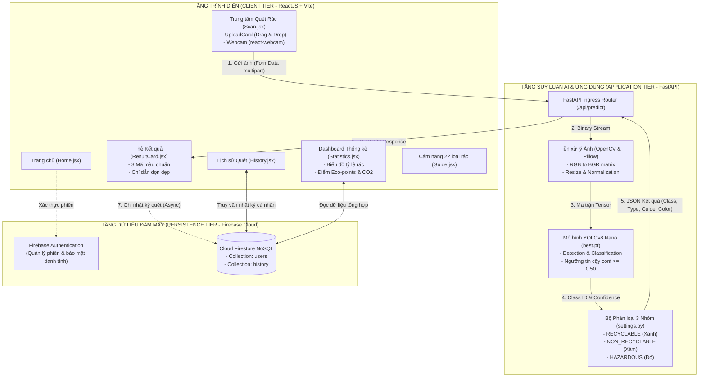

# BỘ HỒ SƠ TÀI LIỆU KỸ THUẬT HỆ THỐNG ECOSORT AI
## HỆ THỐNG PHÂN LOẠI RÁC THẢI THÔNG MINH ỨNG DỤNG THỊ GIÁC MÁY TÍNH VÀ TRÍ TUỆ NHÂN TẠO

Hồ sơ tài liệu kỹ thuật này được thiết kế và biên soạn theo chuẩn mực phân tích hệ thống công nghệ cao, phản ánh toàn diện quá trình từ nghiên cứu khám phá sản phẩm (Product Discovery), xác lập tài liệu yêu cầu (PRD), phân tích kiến trúc kỹ thuật (System Requirements), danh mục câu chuyện người dùng (User Stories & Acceptance Criteria), cho tới đặc tả chi tiết từng tính năng (Feature Specification).

---

## 📑 DANH MỤC TÀI LIỆU CHI TIẾT

| Mã Tài Liệu | Tên Tài Liệu Kỹ Thuật | Nội Dung Trọng Tâm | Tệp Tài Liệu |
| :---: | :--- | :--- | :---: |
| **3.1** | **Khám phá Sản phẩm (Product Discovery)** | Phân tích không gian vấn đề khủng hoảng rác thải đô thị; Luật BVMT 2020; Khảo sát người dùng thực tế (N=350); Bản đồ thấu cảm (Empathy Map); Ma trận đối thủ cạnh tranh; Khung đề xuất giá trị (VPC) và Mô hình kinh doanh tinh gọn (BMC). | [Xem Tài liệu 3.1](./3.1_Kham_Pha_San_Pham_Product_Discovery.md) |
| **3.2** | **Tài liệu Yêu cầu Sản phẩm (PRD)** | Tầm nhìn & Mục tiêu chiến lược (OKRs); Chân dung người dùng (User Personas); Hành trình người dùng (User Journey); Phân hệ yêu cầu chức năng (FR-1 đến FR-7); Yêu cầu phi chức năng (NFR); Ma trận phân loại 22 lớp rác; Lộ trình phát hành (Roadmap). | [Xem Tài liệu 3.2](./3.2_Tai_Lieu_Yeu_Cau_San_Pham_PRD.md) |
| **3.3** | **Phân tích Yêu cầu Kỹ thuật Hệ thống** | Sơ đồ luồng dữ liệu DFD Cấp 0 & Cấp 1; Sơ đồ tuần tự UML (Sequence Diagram); Kiến trúc 3 tầng phân tách (ReactJS - FastAPI - Firebase); Phân tích đánh đổi kỹ thuật (YOLOv8 Nano vs các mô hình khác); Từ điển dữ liệu (Data Dictionary); Đặc tả API REST. | [Xem Tài liệu 3.3](./3.3_Phan_Tich_Yeu_Cau.md) |
| **3.4** | **User Stories & Tiêu chí Chấp nhận** | Khung chuẩn mực Agile Scrum & INVEST; Cấu trúc 6 Epics lớn; 13 User Stories chi tiết viết theo cú pháp Gherkin BDD (*Given - When - Then*); Định nghĩa Hoàn thành (DoD); Ma trận truy vết yêu cầu (Requirements Traceability Matrix - RTM). | [Xem Tài liệu 3.4](./3.4_User_Stories_Va_Tieu_Chi_Chap_Nhan.md) |
| **3.5** | **Đặc tả Tính năng Chi tiết (Feature Specification)** | Kiến trúc Component Frontend; Máy trạng thái (State Machine); Đặc tả kỹ thuật FS-01 (Scanner/Webcam), FS-02 (AI Service & OpenCV), FS-03 (Firestore Sync), FS-04 (Analytics & Eco-points), FS-05 (Eco-Guide), FS-06 (Auth); Benchmark hiệu năng suy luận. | [Xem Tài liệu 3.5](./3.5_Dac_Ta_Tinh_Nang_Feature_Specification.md) |

---

## 🏛️ SƠ ĐỒ KIẾN TRÚC TỔNG THỂ HỆ THỐNG

---

## 🎯 3 NHÓM PHÂN LOẠI MÔI TRƯỜNG CHUẨN MỰC

* 🟢 **RÁC TÁI CHẾ (RECYCLABLE) - Mã màu: `#22c55e`**
  * *Bao gồm 5 loại:* Thùng carton (`cardboard_box`), Lon kim loại (`can`), Nắp chai nhựa (`plastic_bottle_cap`), Chai nhựa PET/HDPE (`plastic_bottle`), Giấy có thể tái chế (`reuseable_paper`).
  * *Chỉ dẫn hành động:* Rửa sạch cặn bẩn, phơi khô, bóp xẹp tiết kiệm thể tích và bỏ vào thùng tái chế.
* ⚪ **RÁC KHÔNG TÁI CHẾ / SINH HOẠT (NON-RECYCLABLE) - Mã màu: `#64748b`**
  * *Bao gồm 11 loại:* Túi nilon (`plastic_bag`), Giấy dơ dính dầu mỡ (`scrap_paper`), Que gỗ (`stick`), Cốc nhựa dùng một lần (`plastic_cup`), Vỏ bánh kẹo màng nhôm (`snack_bag`), Hộp xốp định hình (`plastic_box`), Ống hút (`straw`), Nắp cốc dùng một lần (`plastic_cup_lid`), Mảnh nhựa vụn (`scrap_plastic`), Tô giấy thức ăn (`cardboard_bowl`), Dao thìa dĩa nhựa (`plastic_cultery`).
  * *Chỉ dẫn hành động:* Cho vào túi rác sinh hoạt gia đình, buộc kín miệng túi trước khi chuyển cho đội vệ sinh.
* 🔴 **RÁC NGUY HẠI (HAZARDOUS) - Mã màu: `#ef4444`**
  * *Bao gồm 6 loại:* Pin các loại (`battery`), Bình xịt hóa chất nén khí (`chemical_spray_can`), Chai hóa chất tẩy rửa (`chemical_plastic_bottle`), Can nhựa đựng hóa chất công nghiệp (`chemical_plastic_gallon`), Bóng đèn huỳnh quang/LED (`light_bulb`), Thùng vỏ sơn (`paint_bucket`).
  * *Chỉ dẫn hành động:* Cần phân loại riêng, không đập vỡ bóng đèn, không chọc thủng bình xịt, dán cách điện hai cực pin và bàn giao cho cơ sở thu gom rác thải nguy hại chuyên biệt.
